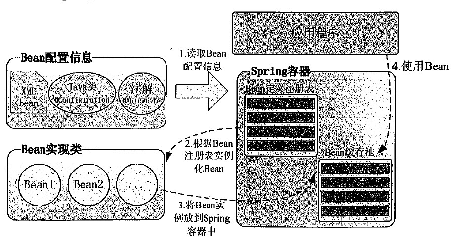

+ Spring 容器是 Spring 框架的核心。容器将创建对象，把它们连接在一起，配置它们，并管理他们的整个生命周期从创建到销毁。Spring 容器使用依赖注入（DI）来管理组成一个应用程序的组件。这些对象被称为 Spring Beans。

+ IOC 容器**具有依赖注入功能的容器，它可以创建对象，IOC 容器负责实例化、定位、配置应用程序中的对象及建立这些对象间的依赖。通常new一个实例，控制权由程序员控制，而"控制反转"是指new实例工作不由程序员来做而是交给Spring容器来做。

  

+ Spring框架的核心功能之一就是通过依赖注入的方式来管理Bean之间的依赖关系。每个基于应用程序的 java 都有几个对象，这些对象一起工作来呈现出终端用户所看到的工作的应用程序。当编写一个复杂的 Java 应用程序时，应用程序类应该尽可能独立于其他 Java 类来增加这些类重用的可能性，并且在做单元测试时，测试独立于其他类的独立性。依赖注入（或有时称为布线）有助于把这些类粘合在一起，同时保持他们独立。

+ 从 Spring 2.5 开始就可以使用**注解**来配置依赖注入。而不是采用 XML 来描述一个 bean 连线，你可以使用相关类，方法或字段声明的注解，将 bean 配置移动到组件类本身。在 XML 注入之前进行注解注入，因此后者的配置将通过两种方式的属性连线被前者重写。注解连线在默认情况下在 Spring 容器中不打开。因此，在可以使用基于注解的连线之前，我们将需要在我们的 Spring 配置文件中启用它。所以如果你想在 Spring 应用程序中使用的任何注解。

+ 属性连线是指配置DI(依赖注入)的方式，之前学了可以在<bean ...></bean>里面使用<constructor-arg .../>和<property .../> 元素做属性连线，这两种方式详见[此处](https://www.w3cschool.cn/wkspring/)。

  Spring里还可以直接在类里用Annotation来做属性连线，以增强或者替代上述两种方式。

  基于Annotation的属性连线默认不开启，需要在<beans ...></beans>里加入：

  ~~~xml
  <context:annotation-config/>
  ~~~

  一旦 被配置后，你就可以开始注解你的代码，表明 Spring 应该自动连接值到属性，方法和构造函数。

+ 几个重要的注解

  |                                                              |                                                              |
  | ------------------------------------------------------------ | ------------------------------------------------------------ |
  | [@Required](https://www.w3cschool.cn/wkspring/9sle1mmh.html) | 注解应用于 bean 属性的 setter 方法。注释应用于 bean 属性的 setter 方法，它表明受影响的 bean 属性在配置时必须放在 XML 配置文件中，否则容器就会抛出一个 BeanInitializationException 异常。 |
  | [@Autowired](https://www.w3cschool.cn/wkspring/rw2h1mmj.html) | 可以应用到 bean 属性的 setter 方法，非 setter 方法，构造函数和属性。 |
  | [@Qualifier](https://www.w3cschool.cn/wkspring/knqr1mm2.html) | 通过指定确切的将被连线的 bean，@Autowired 和 @Qualifier 注解可以用来删除混乱。 |
  | [JSR-250 Annotations](https://www.w3cschool.cn/wkspring/lmsq1mm4.html) | Spring 支持 JSR-250 的基础的注解，其中包括了 @Resource，@PostConstruct 和 @PreDestroy 注解。 |

  

### 个人理解

+ 依赖注入：在我理解就是将一个类中依赖其他的类的事情完成。

+ 控制翻转：就是本来按照程序执行来说，你需要自己生成实例对象，然后作为参数传到类中的构造函数中（或用于类的一些set方法中），这个过程就不用自己new实例，而是由Spring来帮你完后，这就是翻转。

+ 而属性连线就是说依赖注入，将类中的域全部进行赋值。
+ 

### 问题

+ @Autowired 使用失败